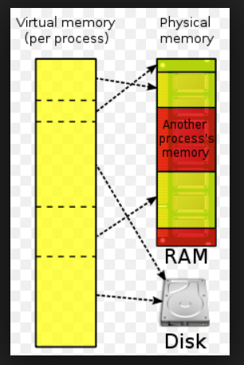
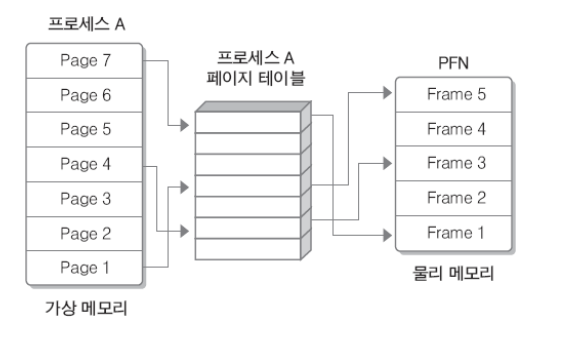

## virtual memory


### 3.1 질문

------

- 질문 1 : 가상메모리는 무엇인가? 
- 질문 2 : 페이지와 스왑은 무엇인가? 
- 질문 3 : 디스크와 메모리의 속도 차이는 어느 정도이가 그 원인은 무엇인가? 
- 질문 4 :  ssd의 장점은 무엇인가? 


### 3.2 메모리 공간

---

1. 가상 메모리 
2. 실제 메모리 
   1. ram 
   2. ssd, 하드디스크

### 3. 3 프로세스와 가상 메모리 

* 모든 프로세스는 자신만의 가상 주소 공간을 가지고 있다. 
* 프로세스의 수행을 위해서는 쓰레드가 사용할 메모리 공간이 필요하다. 
* 특정 프로세스 내에서 쓰레드가 수행될 때 해당 쓰레드는 프로세스가 소유하고 있는 메모리에 대해서만 접근이 가능하다. 
* 가상 메모리는 프로세스의 "logical memory"와 "physical memory"를 분리하기 위해 사용된다. 
* 프로세스는 가상 메모리를 이용해 실제로 필요로 하는 부분만 메모리에 올리는 "demand paging" 기법을 사용한다. 
* **프레임**은 물리 메모리를 사용하는 최소 크기 단위, **페이지**는 가상 메모리를 사용하는 최소 크기 단위  프레임의 크기와 페이지의 크기는 동일하다.


### 3.4 기본적인 동작 과정

---




* 프로세스를 실행하기 위해서는 데이터를 저장시켜놓을 메모리 공간이 필요하다. 하지만 물리메모리는 물리적 한계가 있기 때문에, 물리 메모리를 직접 사용하기전에 가상메모리를 먼저 사용한 후 가상메모리에 저장되어 있는 정보들을 물리 메모리에 매칭시켜 사용한다. 


#### 3.4.1 순서 



1. 실행시키고자 하는 프로세스들을 **페이징** 과정을 수행한다. 

   * 페이징 과정을 통해 필요한 페이지만 페이지 테이블을 통해 메모리에 적재시킨다. 이 페이지 테이블을 통해 가상 메모리들의 페이지를 관리한다. 

2. 프로그램이 실행되면, 가상메모리에서는 필요한 페이지만 물리 메모리에 **mapping** 한다. 

   * mapping은 **MMU**(Memory Management Unit)라는 하드웨어를 통해 구현된다. 
   * mapping의 방식에는 1. paging, 2. segmentation, 3. 이 둘을 혼합한 방식으로 3가지의 방법이 존재한다. (주로 사용되는 것은 1. paging 방식)
   * 데이터의 전달방식은 **주소버스**(address bus)와 **주소비트**(address bit)을 이용하여 전달한다. (핵심은 주소의 값을 가지고 주소들을 서로 교환하며 데이터를 전달하는 것)

3. 그러다 프로그램의 페이지가 물리 메모리에 부재할 경우 **페이지 폴트** 가 발생한다. 

4. 페이지 폴트가 발생하면 **요구 페이징** 과정을 통해 가상 메모리에서 필요한 페이지를 물리 메모리로 가져온다. 

   * 요구 페이징 과정 

     ```
     1. CPU는 물리 메모리을 확인하여 페이지가 없으면 trap을 발생하여 운영체제에 알린다.
     
     2. 운영체제는 CPU의 동작을 잠시 멈춘다.
     
     3. 운영체제는 페이지 테이블을 확인하여 가상 메모리에 페이지가 존재하는지 확인하고, 없으면 프로세스를 중단한다.
     
     4. 페이지 폴트이면, 현재 물리 메모리에 비어있는 프레임(Free Frame)이 있는지 찾는다. (단 비어있는 프레임이 없다면, 희생 프레임을 골라 이를 가상 메모리에 저장시킨 후 필요한 페이지를 물리 메모리에 로드한다. 이것을 "페이지 교체 알고리즘" 이라고 한다. )
     
     5. 비어있는 프레임에 해당 페이지를 로드하고, 페이지 테이블을 최신화 한다.
     
     6. 중단되었던 CPU를 다시 시작한다. 
     ```

     > 페이지 교체 알고리즘에는 1. FIFO, 2. LRU, 3. LRU Approximation이 있음 
     >
     > 이건 필요할 때 추가적으로 알아볼 것!!

   

### 3. 5 대답

------

- 질문 1 : 가상메모리는 무엇인가? 

- 대답 1 :  

  - 메모리로서 실제 존재하지는 않지만 사용자에게 있어 메모리로써 역할을 하는 메모리 

  - 물리적인 메모리의 발달( 처리속도의 향상, 메모리의 증가, 모뎀 속도 향상 등 ) 은 한계가 있으므로 메모리의 사용효율을 최대한으로  끌어내기 위하여 사용되고 있다. 

  - 위의 내용들을 참고할 것! 

    

- 질문 2 : 페이지와 스왑은 무엇인가?

- 대답 2 :

  - 페이지 란? 페이지는 가상 메모리와 물리 메모리를 구분한 후 가상 메모리가 저장하고 있는 데이터의 최소단위이다. 그 페이지를 통해 가상 메모리와 물리 메모리의 데이터 전달이 이루어진다. 

  - 페이지 테이블을 통해 가상 메모리의 데이터들을 페이징한 후 가상 메모리와 물리 메모리 사이의 데이터 교환을 **swap**이라고 한다. page -> frame로의 전달  

  - 스왑은 가상 메모리가 물리 메모리처럼 보이게 하는 역할을 하고 있다. 

  - **스왑 아웃** : 물리 메모리에서 프로세스를 내보내는 것 (하드 디스크로) , **스왑 인** : 물리 메모리로 프로세스를 넣는 것

    

- 질문 3 : 디스크와 메모리의 속도 차이는 어느 정도이가 그 원인은 무엇인가?

- 대답 3 : 

  - 위에서 말하는 디스크는 ssd 또는 하드디스크를 의미한다. 메모리는 ram을 의미한다. 디스크 보다 ram의 속도가 월등히 높다. 
  - ram의 속도가 높은 이유는 응용프로그램의 데이터 로딩을 직접관장한다. cpu는 레지스터를 통해 ram 메모리에서 데이터를 주고 받는다. 하지만 ram의 물리 저장 공간은 한정되어 있다. 
  - 이런 문제를 해결하기 위하여 보조기억장치 hdd, ssd등이 사용되는 것이다. 
  - ram에서는 현재 직접 사용하고 있지 않는 데이터에 대해서는 스왑을 통해 하드디스크에 저장시켜 놓는다. 그러다 필요할 때가 되면 다시 하드디스크에서 정보를 찾아가 불러온다. 
  - 이렇게 cpu는 ram을 메모리 공간으로 우선적으로 사용하고 ram이 보조적으로 하드디스크를 사용한다. 그렇다 보니 ram의 속도가 월등히 높은 것이다. 

  

  

- 질문 4 : ssd의 장점은 무엇인가?

- 대답 4 : 

  - ssd는 hdd와 비교해서 읽기/쓰기 속도가 월등히 빠르다. 그러나 hdd에 비해서 저장공간이 작자. 저장공간이 큰 ssd의 경우 가격이 굉장히 높아진다.
  - ssd는 hdd에 비해서 소음이 월등히 작다. 
  - ssd는 hdd에 비해서 전력소모량이 적다. 


> <https://l2men.tistory.com/21> 
>
> <https://copycode.tistory.com/113>
>
> <https://preamtree.tistory.com/21>
>
> <http://egloos.zum.com/sweeper/v/2988689>
>
> <https://m.blog.naver.com/PostView.nhn?blogId=rasede&logNo=150138188452&proxyReferer=https%3A%2F%2Fwww.google.com%2F>


### 3.6 키워드

---

* **인위적 연속성**

---

* **페이지** 과 **페이징**

: 페이징 방식에서는 가상 메모리상의 주소공간을 일정한 크기의 페이지로 분할하게 되는데, 실제 메모리 또한 가상메모리와 같은 크기로 페이지를 분할한다. 페이지는 1kbyte, 2kbyte, 4kbyte등으로 시스템에 따라 크기가 정해져 있고 대부분 4kbyte의 크기를 사용한다. 

페이지의 크기는 단편화를 위해 작을수록 좋겠지만 너무 작으면 페이지 단위의 입/출력이 너무 자주 일어나 전체적인 시스템에 처리성능이 저하된다. 

---

* **페이지 테이블**

:페이지 테이블은 가상 메모리와 물리 메모리를 페이지로 나누어 놓고, 이 두 메모리 사이의 페이지 연결을 도와주는 도구이다. 

페이지 테이블은 가상 메모리의 페이지넘버와 물리 메모리의 페이지프레임이 하나의 순서쌍으로 저장되어 있는 도표이다. 

* **demand-paging**

: 이전의 요구 페이징 단계를 참고할 것

* 

  